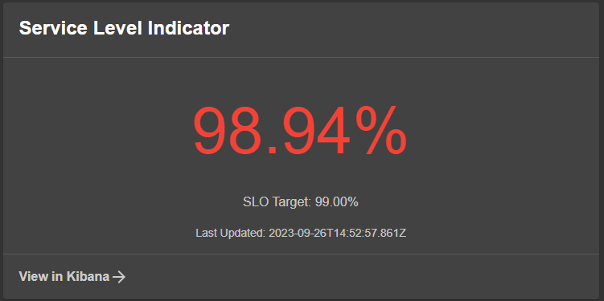
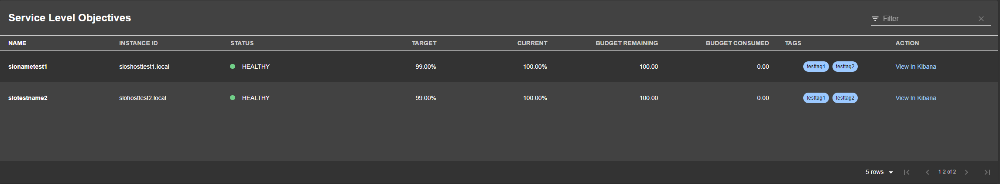
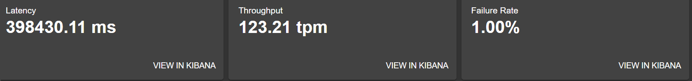
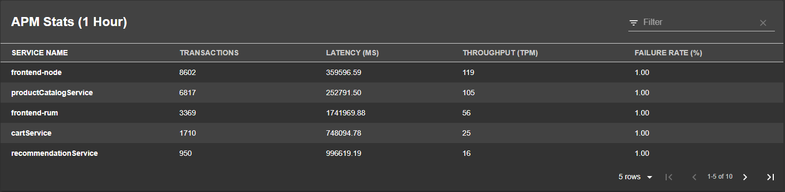

# Elastic Backstage Plugin (Frontend)

Welcome to the Unofficial [Elastic](https://www.elastic.co/) frontend plugin for Backstage.

This plugin is **NOT** covered by any Elastic support contracts or SLA's.

The scope of this plugin is currently to retrieve SLO information from Kibana about any entity in Backstage with the correct annotations, but once finalized there are more usecases which will be added.

For more information about how to setup and configure the Elastic stack or SLO, please visit the [Kibana SLO Documentation](https://www.elastic.co/guide/en/observability/current/slo.html).

## Limitations:

**SLO**: Requires Kibana version 8.10.1 or higher. SLO was initially introduced in 8.9x, however 8.10.1 provides a better API for querying.
**APM**: Currently only tested on 8.10.1+, however older versions should work, will update once tested more. As long as the underlying APM data has not changed its format it should work. If a version is found having a different data format then please report it as an issue.

## Setup

### General

1. Add your plugin to your current backstage app:

```bash
# From your Backstage root directory
yarn add --cwd packages/app @p1llus/backstage-plugin-elastic
```

2. Add and configure the [elastic-backend](../elastic-backend) plugin.

### Elastic SLO Card

**Screenshot:**


**React Component**:
The SLO card react component is called `EntityElasticSloCard`, and can be added anywhere in your application. The below example shows the steps to add it to your entity overview page but only when its available.
`isElasticSloIdAvailable` is true if the entity is annotated with `elastic/slo-id`, see below for annotations examples. We use this to only display the UI components when necessary.

```tsx
// In packages/app/src/components/catalog/EntityPage.tsx
import {
  EntityElasticSloCard,
  isElasticSloIdAvailable,
} from '@p1llus/backstage-plugin-elastic';

// You can add the tab to any number of pages, the service page is shown as an
// example here
const serviceEntityPage = (
  <EntityLayout>
    <EntityLayout.Route path="/" title="Overview">
      {/* ... */}
      <EntitySwitch>
        <EntitySwitch.Case if={isElasticSloIdAvailable}>
          <Grid item sm={6}>
            <EntityElasticSloCard />
          </Grid>
        </EntitySwitch.Case>
        {/* ... */}
      </EntitySwitch>
    </EntityLayout.Route>
    {/* other tabs... */}
    {/* ... */}
  </EntityLayout>
);
```

**Supported annotation**:

- `elastic/instance`
- `elastic/space`
- `elastic/slo-id`

All entities using the elastic plugin needs to be annotated with the `elastic/instance` annotation, this is expected to hold the instance name for any of the instances in your app-config.yaml (see example below).

If the SLO is not created in the default Kibana `space`, please also include an optional `elastic/space` annotation that specifies the name of the `space` you want to use.

The SLO card is a gauge type and expects to represent a single SLO, and for that uses a `elastic/slo-id` annotation:

The `elastic/slo-id` annotation has 1 mandatory and 1 optional field, separated by `/`

- `SLO ID`: This is the ID of your SLO created in Kibana, for example by viewing the SLO in the Kibana UI will show the ID of the relevant SLO.
- `SLO Instance ID (optional)`: When a SLO is configured in Kibana, there is an option to `partition` on a choosen field, for example a hostname field. When this is performed, a SLO is created per unique hostname value found, but with the same SLO ID, in these cases the Instance ID is necessary to tell exactly which SLO we want to collect. This can also be seen in the URL when visiting the SLO itself in Kibana. Please see example below.

Config example from backend plugin:

```yaml
elastic:
  allow_guests: true
  instances:
    - name: somecluster
      kibana:
        baseUrl: https://testkibana.com:5601
        apiKey: ${KIBANA1_KEY}
      elasticsearch:
        baseUrl: https://testes.com:9200
        apiKey: APIKEY
```

Manifest example (Any entity type/kind is supported, but example is for Component):

```yaml
apiVersion: backstage.io/v1alpha1
kind: Component
metadata:
  name: example-website
  annotations:
    # Example pivot by hostname, so we add the specific hostname we want at the end.
    elastic/instance: somecluster
    elastic/slo-id: 123abcsloid/hostname1.local
    # If we did not need to pivot, it would simply be the SLO ID without a /.
    # elastic/slo-id: 123abcsloid
spec:
  type: website
  lifecycle: experimental
  owner: guests
  system: examples
  providesApis: [example-grpc-api]
```

### Elastic SLO Table

**Screenshot:**


**React Component**:
The SLO Table react component is called `EntityElasticSloTableContent`, and can be added anywhere in your application. The below example shows the steps to add it to one of your Team Tabs page but only when its available.
`isElasticSloQueryAvailable` is true if the entity is annotated with `elastic/slo-query`, see below for annotations examples. We use this to only display the UI components when necessary.

```tsx
// In packages/app/src/components/catalog/EntityPage.tsx
import {
  EntityElasticSloTableContent,
  isElasticSloQueryAvailable,
} from '@p1llus/backstage-plugin-elastic';

// You can add the tab to any number of pages, the service page is shown as an
// example here
const groupPage = (
  <EntityLayout>
    <EntityLayout.Route path="/" title="Overview">
      {/* ... */}
    </EntityLayout.Route>
    <EntityLayout.Route path="/slos" title="SLO/SLI">
      <EntitySwitch>
        <EntitySwitch.Case if={isElasticSloQueryAvailable}>
          <Grid container spacing={3} alignItems="stretch">
            <Grid item md={6}>
              <EntityElasticSloTableContent />
            </Grid>
          </Grid>
        </EntitySwitch.Case>
        {/*_ ... _*/}
      </EntitySwitch>
    </EntityLayout.Route>
    {/* other tabs... */}
  </EntityLayout>
);
```

**Supported annotation**:

- `elastic/instance`
- `elastic/space`
- `elastic/slo-query`

All entities using the elastic plugin needs to be annotated with the `elastic/instance` annotation, this is expected to hold the instance name for any of the instances in your app-config.yaml (see example below).

If the SLO is not created in the default Kibana `space`, please also include an optional `elastic/space` annotation that specifies the name of the `space` you want to use.

The SLO table is a Backstage data table that represents a list of all SLO's that matches the [KQL](https://www.elastic.co/guide/en/kibana/current/kuery-query.html) query provided in the annotation `elastic/slo-query`:

The `elastic/slo-query` annotation has 1 mandatory fields.

`SLO QUERY`: This is the [KQL](https://www.elastic.co/guide/en/kibana/current/kuery-query.html) query that can match one or many configured SLO's. While it does support wildcards, it only supports it as a trailing wildcard, not before a value (so `slo.name: *test` does not work, but `slo.name: test*` does.)

Config example from backend plugin:

```yaml
elastic:
  allow_guests: true
  instances:
    - name: somecluster
      kibana:
        baseUrl: https://testkibana.com:5601
        apiKey: ${KIBANA1_KEY}
      elasticsearch:
        baseUrl: https://testes.com:9200
        apiKey: APIKEY
```

Manifest example (Any entity type/king is supported, but example is for Group):

```yaml
apiVersion: backstage.io/v1alpha1
kind: Group
metadata:
  name: guests
  annotations:
    elastic/instance: someinstancename
    elastic/slo-query: 'slo.name: test* and slo.environment: prod'
    #Some other examples
    #elastic/slo-query: 'slo.tag: team1'
spec:
  type: team
  children: []
```

### Elastic APM Card

**Screenshot:**


**React Component**:
The APM card react component is called `EntityElasticApmCard`, and can be added anywhere in your application. The below example shows the steps to add it to your entity overview page but only when its available.
`isElasticApmNameAvailable` is true if the entity is annotated with `elastic/apm-name`, see below for annotations examples. We use this to only display the UI components when necessary.

```tsx
// In packages/app/src/components/catalog/EntityPage.tsx
import {
  EntityElasticApmCard,
  isElasticApmNameAvailable,
} from '@p1llus/backstage-plugin-elastic';

// You can add the tab to any number of pages, the service page is shown as an
// example here
const serviceEntityPage = (
  <EntityLayout>
    <EntityLayout.Route path="/" title="Overview">
      {/* ... */}
      <EntitySwitch>
        <EntitySwitch.Case if={isElasticApmNameAvailable}>
          <Grid item sm={8}>
            <EntityElasticApmCard />
          </Grid>
        </EntitySwitch.Case>
        {/* ... */}
      </EntitySwitch>
    </EntityLayout.Route>
    {/* other tabs... */}
    {/* ... */}
  </EntityLayout>
);
```

**Supported annotation**:

- `elastic/instance`
- `elastic/space`
- `elastic/apm-name`

All entities using the elastic plugin needs to be annotated with the `elastic/instance` annotation, this is expected to hold the instance name for any of the instances in your app-config.yaml (see example below).

If the APM service that the Card should link back to is not created in the default Kibana `space`, please also include an optional `elastic/space` annotation that specifies the name of the `space` you want to use.

The APM card is a collection of 3 info boxes displaying the average latency, throughput and failure rate for the annoated service name. It expects to represent a single APM service, and for that uses a `elastic/apm-name` annotation:

The `elastic/apm-name` annotation has 1 mandatory and 1 optional field, separated by `/`

- `APM Service Name`: This is the service name of your configured APM application created in Kibana, it can be found by going to the APM overview in the Kibana UI.
- `DSL Query (optional)`: Sometimes there is a need to further filter down data, and this optional value represents [Elastic DSL filter](https://www.elastic.co/guide/en/elasticsearch/reference/current/query-filter-context.html#filter-context) items.

Config example from backend plugin:

```yaml
elastic:
  allow_guests: true
  instances:
    - name: somecluster
      kibana:
        baseUrl: https://testkibana.com:5601
        apiKey: ${KIBANA1_KEY}
      elasticsearch:
        baseUrl: https://testes.com:9200
        apiKey: APIKEY
```

Manifest example (Any entity type/king is supported, but example is for Component)::

```yaml
apiVersion: backstage.io/v1alpha1
kind: Component
metadata:
  name: example-website
  annotations:
    elastic/instance: somecluster
    # Example viewing information from the "someappname" with an optional custom query to only use prod data.
    elastic/apm-name: 'someappname/{"term":{"service.environment":"prod"}}'
    # Example without query:
    # elastic/apm-name: 'someappname
spec:
  type: website
  lifecycle: experimental
  owner: guests
  system: examples
  providesApis: [example-grpc-api]
```

### Elastic APM Table

**Screenshot:**


**React Component**:
The APM table react component is called `EntityElasticApmTableContent`, and can be added anywhere in your application. The below example shows the steps to add it to a Team page as a tab but only when its available.
`isElasticApmQueryAvailable` is true if the entity is annotated with `elastic/apm-query`, see below for annotations examples. We use this to only display the UI components when necessary.

```tsx
// In packages/app/src/components/catalog/EntityPage.tsx
import {
  EntityElasticApmTableContent,
  isElasticApmQueryAvailable,
} from '@p1llus/backstage-plugin-elastic';

// You can add the tab to any number of pages, the service page is shown as an
// example here
const groupPage = (
  <EntityLayout>
    <EntityLayout.Route path="/" title="Overview">
      {/*_ ... _*/}
    </EntityLayout.Route>
    <EntityLayout.Route path="/apm" title="APM">
      <EntitySwitch>
        <EntitySwitch.Case if={isElasticApmQueryAvailable}>
          <Grid container spacing={3} alignItems="stretch">
            <Grid item md={8}>
              <EntityElasticApmTableContent />
            </Grid>
          </Grid>
        </EntitySwitch.Case>
        {/*_ ... _*/}
      </EntitySwitch>
    </EntityLayout.Route>
    {/*_ other tabs... _*/}
  </EntityLayout>
);
```

**Supported annotation**:

- `elastic/instance`
- `elastic/space`
- `elastic/apm-query`

All entities using the elastic plugin needs to be annotated with the `elastic/instance` annotation, this is expected to hold the instance name for any of the instances in your app-config.yaml (see example below).

If the APM service that the Table should link back to is not created in the default Kibana `space`, please also include an optional `elastic/space` annotation that specifies the name of the `space` you want to use.

The APM table is a aggregation of stats like throughput, latency and failure rate that is split by a specific field defined in the annotation, and for that uses a `elastic/apm-query` annotation:

The `elastic/apm-query` annotation has 1 mandatory and 1 optional field, separated by `/`

- `Group By fieldname`: This is which field to aggregate on, if you do not know which value you want, you should start with `service.name` which splits up the stats for each application.
- `DSL Query (optional)`: Sometimes there is a need to further filter down data, and this optional value represents [Elastic DSL filter](https://www.elastic.co/guide/en/elasticsearch/reference/current/query-filter-context.html#filter-context) items.

Config example from backend plugin:

```yaml
elastic:
  allow_guests: true
  instances:
    - name: somecluster
      kibana:
        baseUrl: https://testkibana.com:5601
        apiKey: ${KIBANA1_KEY}
      elasticsearch:
        baseUrl: https://testes.com:9200
        apiKey: APIKEY
```

Manifest example:

```yaml
apiVersion: backstage.io/v1alpha1
kind: Component
metadata:
  name: example-website
  annotations:
    elastic/instance: somecluster
    # Example viewing information grouped by the service.name field with an optional custom query to only use prod data.
    elastic/apm-query: 'service.name/{"term":{"service.environment":"prod"}}'
    # Example without query:
    # elastic/apm-query: 'service.name
spec:
  type: website
  lifecycle: experimental
  owner: guests
  system: examples
  providesApis: [example-grpc-api]
```
